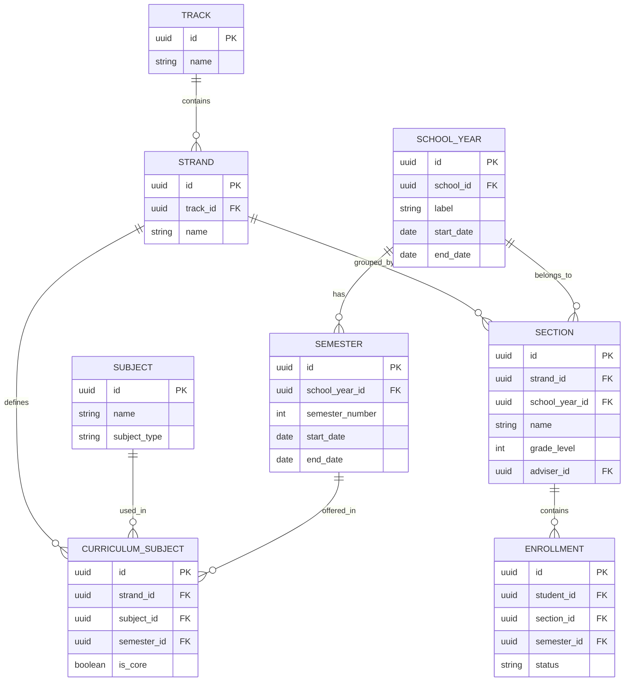
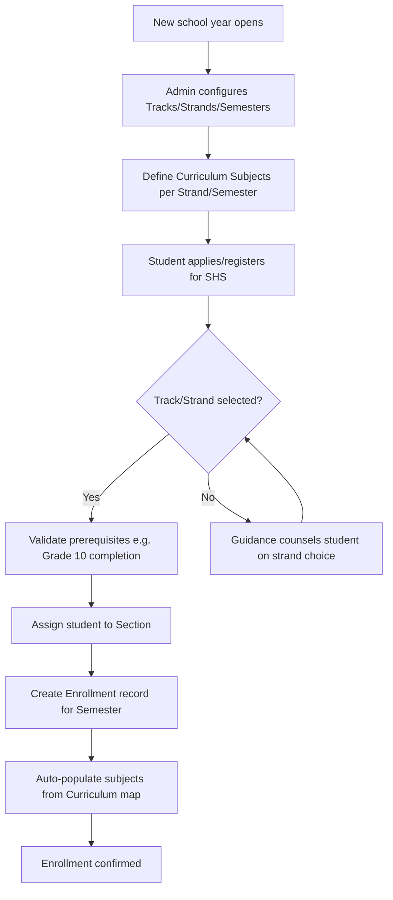

# Module 2: Enrollment & Academic Structure

## System Overview

This file is one module out of a set of module-context files for the **Senior High School LMS**
— a Learning Management System for Grades 11–12 under the Philippine K-12 Tracks/Strands
curriculum (Academic, TVL, Sports, Arts & Design tracks; STEM, ABM, HUMSS, GAS, etc. strands),
adaptable to any SHS setup.

**Tech stack (as planned):** Laravel (backend/API) + Vue.js (frontend SPA). *Correction: the actual codebase never adopted Vue — it is server-rendered Laravel Blade + Alpine.js + ApexCharts (see `package.json`; no Vue dependency exists). See Module 16 and `modules/README.md` for real implementation status.* See **Section 0 — Tech Stack** in
[`senior-high-school-lms-plan.md`](../senior-high-school-lms-plan.md) for the full stack decision,
the strict scalability/readability rule that governs all code in this project, and an explanation
of the Laravel file structure.

**Full plan:** [`senior-high-school-lms-plan.md`](../senior-high-school-lms-plan.md) contains
the complete module list, the full ERD, all module flowcharts, cross-cutting considerations,
and build phases. This file extracts and expands only what's relevant to this one module so it
can be handed to a developer (or an AI coding assistant) as a self-contained brief.

---

## Function
Manages Tracks (Academic, TVL, Sports, Arts & Design), Strands (STEM, ABM, HUMSS, GAS, etc.), Grade Levels (11/12), Sections, and Semesters (SHS runs on 2 semesters/year, not quarters).

**Keep in mind:**
- A student's subjects depend on their Track/Strand + Semester — build this as a rules-driven curriculum map, not hardcoded.
- Handle strand transfers mid-year (rare but happens).
- Track "specialized subjects" vs "core subjects" vs "applied subjects" since SHS curricula separate these.

---

## Data Model (relevant slice of the master ERD)

---

## Module Flow

---

## Cross-Cutting Concerns That Apply Here

- **Scalability of grading rules:** Different strands/tracks have different weight formulas — model this as data (a "Grading Template" table), not code.
- **Auditability:** Grades, attendance, and guidance records all need "who changed what, when" trails — build this in from the start, it's expensive to bolt on later.

---

## Build Phase

**Phase 1 — Foundation** (see the master plan's Suggested Build Phases for the full sequence).

---

## Implementation Notes

CURRICULUM_SUBJECT is the single source of truth that drives scheduling (3.x) and grading templates (7.x) — never hardcode which subjects belong to a strand/semester.

---

## Implementation Status

*(verified against the codebase, Sept 2026 — see `modules/README.md` for the project-wide table)*

**Done:**
- `EnrollmentController`: full CRUD for `/admin/enrollment` — search by student name/number/LRN, filter by school year/section/semester/status, stats cards, section slot-limit validation on enroll.
- `SubjectController`: full CRUD for `/admin/curriculum` — subjects filterable by strand/teacher/type/grade/semester.
- Models: `Strand`, `Subject`, `ClassSection`, `Enrollment`, `SchoolYear`, `Track`.
- **Fixed (Oct 2026):** `Track.php` now exists in `app/Models/` (`track_id`, `track_code`, `track_name`, `strands()` relation) — `Strand::track()` resolves correctly instead of throwing a class-not-found error. Regression-covered by `tests/Feature/TrackGuardianModelTest.php::test_strand_belongs_to_track_and_track_has_many_strands`.

**Partial / gaps:**
- The master ERD's `CURRICULUM_SUBJECT` join table (strand × subject × semester) was never implemented — the real schema puts `strand_id`, `grade_level`, and `semester` directly on `subjects` instead. Flatter than planned; works at current scale but a subject can't cleanly belong to more than one strand/semester without duplicate rows.
- Student-facing enrollment view (`student/enrollment/index.blade.php`) is an unwired stub.

**Not started:**
- Strand transfer workflow (mid-year).
- Core vs Applied vs Specialized enforcement beyond the `subject_type` enum field (no rules engine).

---

## Related Modules

- [Module 1: User & Role Management](./01-user-role-management.md)
- [Module 3: Class & Scheduling](./03-class-scheduling.md)
- [Module 7: Grading & Report Cards](./07-grading-report-cards.md)
- [Module 15: System Administration](./15-system-administration.md)
