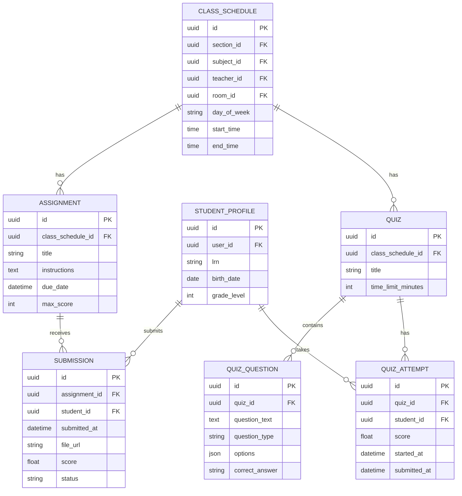
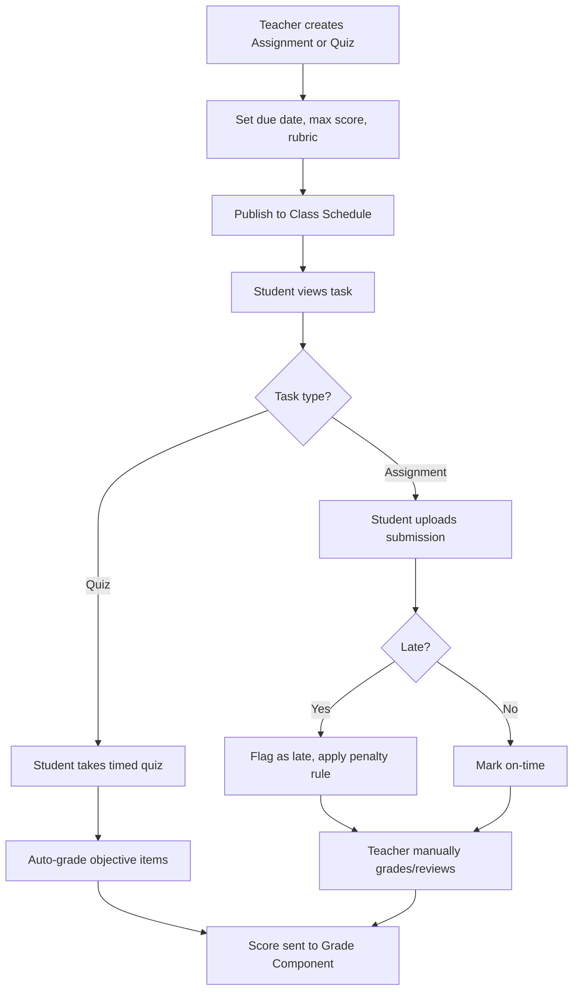

# Module 6: Assignments, Quizzes & Assessments

## System Overview

This file is one module out of a set of module-context files for the **Senior High School LMS**
— a Learning Management System for Grades 11–12 under the Philippine K-12 Tracks/Strands
curriculum (Academic, TVL, Sports, Arts & Design tracks; STEM, ABM, HUMSS, GAS, etc. strands),
adaptable to any SHS setup.

**Tech stack (as planned):** Laravel (backend/API) + Vue.js (frontend SPA). *Correction: the actual codebase never adopted Vue — it is server-rendered Laravel Blade + Alpine.js + ApexCharts (see `package.json`; no Vue dependency exists). See Module 16 and `modules/README.md` for real implementation status.* See **Section 0 — Tech Stack** in
[`senior-high-school-lms-plan.md`](../senior-high-school-lms-plan.md) for the full stack decision,
the strict scalability/readability rule that governs all code in this project, and an explanation
of the Laravel file structure.

**Full plan:** [`senior-high-school-lms-plan.md`](../senior-high-school-lms-plan.md) contains
the complete module list, the full ERD, all module flowcharts, cross-cutting considerations,
and build phases. This file extracts and expands only what's relevant to this one module so it
can be handed to a developer (or an AI coding assistant) as a self-contained brief.

---

## Function
Create/distribute tasks, auto-graded quizzes (MCQ, T/F), manually-graded essays/performance tasks, rubric-based scoring, submission tracking, plagiarism/late-submission flags.

**Keep in mind:**
- Philippine DepEd grading uses **Written Work, Performance Tasks, and Quarterly/Semestral Exams** with weighted percentages that differ by subject type (Academic Track vs TVL) — the grading engine must support configurable weight templates.
- Support rubric grading for performance-based/portfolio tasks (common in TVL and Arts & Design strands).

---

## Data Model (relevant slice of the master ERD)

---

## Module Flow

---

## Cross-Cutting Concerns That Apply Here

- **Scalability of grading rules:** Different strands/tracks have different weight formulas — model this as data (a "Grading Template" table), not code.
- **Offline resilience:** Design APIs to tolerate spotty connections (queue submissions, retry uploads).

---

## Build Phase

**Phase 3 — Academics Core** (see the master plan's Suggested Build Phases for the full sequence).

---

## Implementation Notes

SUBMISSION and QUIZ_ATTEMPT both feed into GRADE_COMPONENT (module 7) — keep the scoring contract between these modules explicit and versioned.

---

## Implementation Status

*(verified against the codebase, Sept 2026 — see `modules/README.md` for the project-wide table)*

**Done:**
- Models `Assignment`, `Quiz`, `QuizAttempt`, `Submission` exist with `Assignment::pendingForStudent()` / `Quiz::pendingForStudent()` scopes — built as Module 16 (Student Dashboard) dependencies, and covered indirectly by `tests/Feature/StudentDashboardTest.php`.
- `Assignment::forSectionCalendar()` / `Quiz::forSectionCalendar()` scopes (section-scoped, due-date-not-null) — built as a Module 9 (Calendar) dependency so assignment/quiz due dates surface on the student calendar, covered by `tests/Feature/CalendarControllerTest.php`.
- `quizzes.due_date` column (migration `2026_09_24_000001_add_due_date_to_quizzes_table`) added so quizzes can appear on the calendar the same way assignments do.
- `AssignmentSeeder` / `QuizSeeder` (wired into `DatabaseSeeder`) generate placeholder assignment/quiz rows against a demo section/schedule so the calendar has data to render out of the box.
- **Assignments loop (built Sept 29, 2026 — not previously documented here):** `TeacherAssignmentController` — index/create/store/show/destroy plus `submissions()` (roster + submission list) and `grade()` (score entry), all owner-scoped to the teacher's own schedules. `StudentAssignmentController` — index (section-scoped list with the student's own submission preloaded), `show`, and `submit()` (file upload, one submission per student, auto-flags `Late` vs `Submitted` by comparing to `due_date`). Full teacher-create → student-submit → teacher-grade → student-sees-score loop. Covered by `tests/Feature/AssignmentLoopTest.php`.
- **Quiz teacher/student flows are now fully built too:** `TeacherQuizController` — index/create/store (bulk question import via CSV, handled by a dedicated `QuizCsvImporter`), destroy, all scoped to quizzes the teacher owns. `StudentQuizController` — index (grouped by subject), take/resume (enforces a configurable attempts-allowed limit), submit (auto-scores objective items), and a results view. Both covered by `tests/Feature/TeacherQuizTest.php` and `tests/Feature/StudentQuizTest.php`.
- **New capability — Assignment discussion/comments:** `AssignmentComment` model (one level of threaded replies, Facebook-style — no infinite nesting) plus `AssignmentCommentController` (store/destroy). Any user who can access the assignment (`Assignment::isAccessibleBy()`) can post; a comment can be deleted by its author or by the teacher who owns the assignment. Rendered via `partials/assignment-comment.blade.php` / `partials/assignment-discussion.blade.php`. Covered by `tests/Feature/AssignmentDiscussionTest.php`.

**Not started:**
- No rubric model/UI — assignments have a flat `max_score`, no weighted rubric criteria.
- No plagiarism detection.

---

## Related Modules

- [Module 5: Content & Learning Materials](./05-content-learning-materials.md)
- [Module 7: Grading & Report Cards](./07-grading-report-cards.md)
- [Module 9: Calendar & Events](./09-calendar-events.md)
