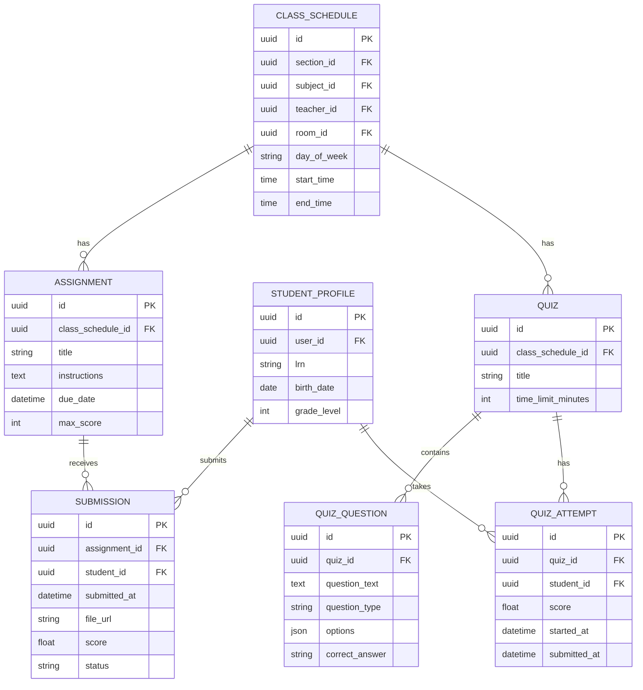
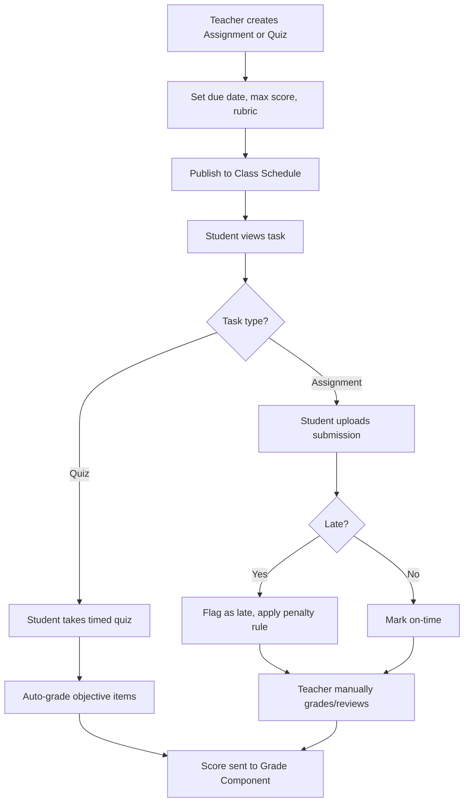

# Module 6: Assignments, Quizzes & Assessments

## System Overview

This file is one module out of a set of module-context files for the **Senior High School LMS**
— a Learning Management System for Grades 11–12 under the Philippine K-12 Tracks/Strands
curriculum (Academic, TVL, Sports, Arts & Design tracks; STEM, ABM, HUMSS, GAS, etc. strands),
adaptable to any SHS setup.

**Tech stack (as planned):** Laravel (backend/API) + Vue.js (frontend SPA). *Correction: the actual codebase never adopted Vue — it is server-rendered Laravel Blade + Alpine.js + ApexCharts (see `package.json`; no Vue dependency exists). See Module 16 and `modules/README.md` for real implementation status.* See **Section 0 — Tech Stack** in
[`senior-high-school-lms-plan.md`](../senior-high-school-lms-plan.md) for the full stack decision,
the strict scalability/readability rule that governs all code in this project, and an explanation
of the Laravel file structure.

**Full plan:** [`senior-high-school-lms-plan.md`](../senior-high-school-lms-plan.md) contains
the complete module list, the full ERD, all module flowcharts, cross-cutting considerations,
and build phases. This file extracts and expands only what's relevant to this one module so it
can be handed to a developer (or an AI coding assistant) as a self-contained brief.

---

## Function
Create/distribute tasks, auto-graded quizzes (MCQ, T/F), manually-graded essays/performance tasks, rubric-based scoring, submission tracking, plagiarism/late-submission flags.

**Keep in mind:**
- Philippine DepEd grading uses **Written Work, Performance Tasks, and Quarterly/Semestral Exams** with weighted percentages that differ by subject type (Academic Track vs TVL) — the grading engine must support configurable weight templates.
- Support rubric grading for performance-based/portfolio tasks (common in TVL and Arts & Design strands).

---

## Data Model (relevant slice of the master ERD)

---

## Module Flow

---

## Cross-Cutting Concerns That Apply Here

- **Scalability of grading rules:** Different strands/tracks have different weight formulas — model this as data (a "Grading Template" table), not code.
- **Offline resilience:** Design APIs to tolerate spotty connections (queue submissions, retry uploads).

---

## Build Phase

**Phase 3 — Academics Core** (see the master plan's Suggested Build Phases for the full sequence).

---

## Implementation Notes

SUBMISSION and QUIZ_ATTEMPT both feed into GRADE_COMPONENT (module 7) — keep the scoring contract between these modules explicit and versioned.

---

## Implementation Status

*(verified against the codebase, Sept 2026 — see `modules/README.md` for the project-wide table)*

**Done — Assignments (full teacher + student loop):**
- `TeacherAssignmentController` (index w/ per-class filter + stats, create, edit, update, destroy, submissions list, grade, download) and `StudentAssignmentController` (index, submit) exist and are routed in `routes/web.php`.
- Views are fully wired, not stubs: `teacher/assignments/{index,create,edit,submissions}.blade.php`, `student/assignments/index.blade.php` (submission upload form included).
- Late-submission flag (`status = 'Late'` vs `'Submitted'`) computed server-side on submit; teacher grading sets `status = 'Graded'`.
- Ownership authorization (a teacher may only manage assignments on their own schedules) and section-membership authorization (a student may only submit within their enrolled section) are enforced and covered by `tests/Feature/AssignmentLoopTest.php` (submit→grade loop, late flag, cross-section 403, cross-teacher 403).
- Models `Assignment`, `Quiz`, `QuizAttempt`, `Submission` exist with `Assignment::pendingForStudent()` / `Quiz::pendingForStudent()` scopes — built as Module 16 (Student Dashboard) dependencies, and covered indirectly by `tests/Feature/StudentDashboardTest.php`.
- `Assignment::forSectionCalendar()` / `Quiz::forSectionCalendar()` scopes (section-scoped, due-date-not-null) — built as a Module 9 (Calendar) dependency so assignment/quiz due dates surface on the student calendar, covered by `tests/Feature/CalendarControllerTest.php`.
- `quizzes.due_date` column (migration `2026_09_24_000001_add_due_date_to_quizzes_table`) added so quizzes can appear on the calendar the same way assignments do.
- `AssignmentSeeder` / `QuizSeeder` (wired into `DatabaseSeeder`) generate placeholder assignment/quiz rows against a demo section/schedule so the calendar has data to render out of the box.

**Done — Quizzes (full teacher + student loop):**
- `TeacherQuizController` (index w/ per-class filter + stats, create, edit, update, destroy, attempts list, grade) and `StudentQuizController` (index, show/take, submit) exist and are routed in `routes/web.php`.
- `QuizQuestion` Eloquent model added (`multiple_choice` / `true_false` / `short_answer`, `options` cast to array, `correct_answer`), with a case/whitespace-insensitive `isCorrect()` helper.
- Views: `teacher/quizzes/{index,create,edit,attempts}.blade.php` (create/edit share a `_form` partial with an Alpine.js dynamic question builder), `student/quizzes/{index,take}.blade.php`.
- Objective questions (`multiple_choice`/`true_false`) auto-grade on submit; a quiz containing any `short_answer` question leaves `score` null so it surfaces on the teacher's "awaiting review" queue instead of guessing.
- Starting an attempt (`GET /student/quizzes/{quiz}`) is idempotent — revisiting resumes the same in-progress `QuizAttempt` row rather than creating duplicates; once `submitted_at` is set, re-taking is blocked (403), mirroring the assignment submission model (no resubmission — see the resubmission gap noted above, which still applies to quizzes).
- Ownership authorization (teacher can only manage quizzes on their own schedules) and section-membership authorization (student can only take quizzes within their enrolled section) enforced and covered by `tests/Feature/QuizLoopTest.php`.

**Not started — other:**
- No rubric model/UI (needed for TVL/Arts & Design performance-task scoring called out in "Keep in mind" above).
- No write path from a graded `Submission`/`QuizAttempt` into `grade_components` (see Module 7) — the `source_type`/`source_id` columns on `grade_components` exist for this but nothing populates them yet. This is the "explicit, versioned scoring contract" the Implementation Notes above call for; it still needs to be built.
- No late-submission score penalty (only the `Late` status flag exists — flowchart's "apply penalty rule" step is not implemented).
- No plagiarism detection.
- `TeacherAssignmentController::index()` loads all of a teacher's assignments with `->get()` (no pagination), unlike `TeacherMaterialController::index()` which paginates — fine at current data volumes, revisit if a teacher accumulates many assignments across sections.

---

## Related Modules

- [Module 5: Content & Learning Materials](./05-content-learning-materials.md)
- [Module 7: Grading & Report Cards](./07-grading-report-cards.md)
- [Module 9: Calendar & Events](./09-calendar-events.md)
